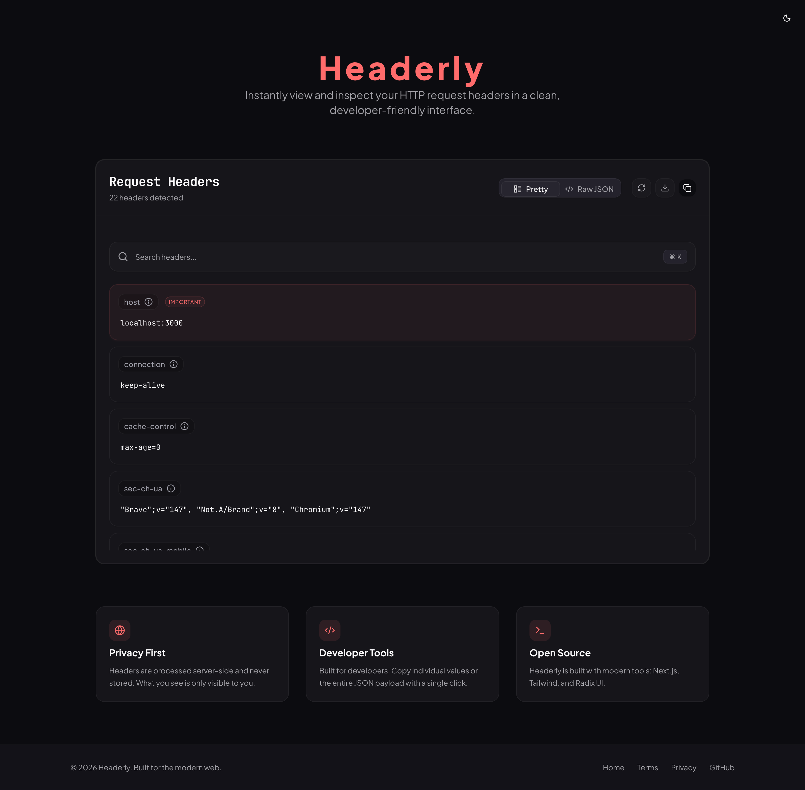

# Headerly 🚀

Headerly is a modern, developer-centric tool designed to instantly view and inspect HTTP request headers and network connection details. Built with a focus on privacy and a premium "Technical-Warmth" aesthetic, it provides a clean interface for developers to debug and analyze their browser's communication with the server.



## 🌟 Key Features

- **Live Header Inspection**: Instantly view all HTTP headers sent by your browser.
- **Network Analysis**: A dedicated page for comprehensive connection details, including IP address, geolocation (City, Region, Country), and ISP information—derived solely from secure edge-computing headers.
- **User-Agent Analysis**: Detailed breakdown of your browser, operating system, and hardware platform, including an educational "How it works" section to understand digital fingerprints.
- **Browser Fingerprinting Dashboard**: An interactive educational tool visualizing tracking mechanisms with a "Uniqueness Score" and detailed browser metrics (e.g., Canvas, WebGL, DNT, Language) to help understand digital privacy risks.
- **Digital Carbon Analyzer**: A built-in tool that calculates a webpage's CO2 footprint based on page size and hosting energy source, promoting green web practices.
- **Enhanced Search**: Lightning-fast header filtering with keyboard shortcuts support (**⌘K** or **Ctrl+K**).
- **Dual View Modes**:
  - **Pretty View**: A clean, organized list with detailed descriptions and MDN documentation links for common headers.
  - **Raw View**: A syntax-highlighted JSON representation for quick copying or debugging.
- **Privacy First**: 
  - **Zero Third-Party APIs**: Geolocation is determined via request headers (Cloudflare Edge), ensuring your IP is never shared with external tracking services.
  - **Non-Persistent**: Headers are processed in real-time and are **never stored** in any database or logs.
- **Developer Tools**:
  - **One-Click Copy**: Copy individual header values or the entire JSON payload.
  - **Download JSON**: Save your headers as a `.json` file for later use.
  - **Instant Refresh**: Re-fetch headers without a full page reload, now with visual feedback.
- **Multi-language Support**: Full internationalization support for English and Turkish locales with a seamless language switcher.
- **Mobile-First Experience**: Fully optimized for all devices with a dedicated mobile navigation menu, responsive dialogs, and horizontal scrolling for long strings.
- **SEO Optimized**: Includes dynamic sitemap generation and localized metadata for enhanced search engine visibility.
- **Dark & Light Mode**: A premium UI that respects your system preferences with a refined "Technical-Warmth" design.

## 🛠️ Tech Stack

Headerly is built using the latest modern web technologies:

- **Framework**: [Next.js 15+](https://nextjs.org/) (App Router & Edge-ready)
- **Styling**: [Tailwind CSS 4](https://tailwindcss.com/)
- **Components**: [Radix UI](https://www.radix-ui.com/) & [Shadcn UI](https://ui.shadcn.com/)
- **Icons**: [Lucide React](https://lucide.dev/)
- **Theming**: [Next Themes](https://github.com/pacocoursey/next-themes)
- **Language**: [TypeScript](https://www.typescriptlang.org/)
- **Internationalization**: [next-intl](https://next-intl-docs.vercel.app/)
- **Parsing**: [ua-parser-js](https://github.com/fent/ua-parser-js)

## 🚀 Getting Started

### Prerequisites

- **Node.js**: 18.x or later
- **npm** or **pnpm** or **yarn**

### Installation

1. **Clone the repository**:
   ```bash
   git clone https://github.com/Alchustan/headerly.git
   cd headerly
   ```

2. **Install dependencies**:
   ```bash
   npm install
   ```

3. **Run the development server**:
   ```bash
   npm run dev
   ```

4. **Open your browser**:
   Navigate to [http://localhost:3000](http://localhost:3000) to see the app in action.

### Production Build

To create an optimized production build:
```bash
npm run build
npm start
```

## 📂 Project Structure

```text
headerly/
├── app/                  # Next.js App Router
│   ├── [locale]/         # Localized route group
│   │   ├── network/      # Network analysis page
│   │   ├── user-agent/   # User-Agent analysis page
│   │   ├── fingerprint/  # Browser fingerprinting dashboard
│   │   ├── green-web/    # Digital carbon footprint analyzer
│   │   ├── privacy/      # Privacy policy
│   │   ├── terms/        # Terms of service
│   │   ├── layout.tsx    # Root layout for locale
│   │   └── page.tsx      # Main inspector page
│   ├── sitemap.ts        # Dynamic sitemap generation
│   └── globals.css       # Global styles
├── components/           # React components
│   ├── mobile-nav.tsx    # Mobile-responsive navigation
│   ├── language-switcher.tsx # Locale toggle component
│   ├── ui/               # Reusable UI components (Shadcn)
│   └── ...               # Feature-specific components
├── i18n/                 # Internationalization configuration
├── messages/             # Translation dictionaries (EN, TR)
├── lib/                  # Utility functions and shared logic
├── public/               # Static assets (images, icons)
├── hooks/                # Custom React hooks
└── ...                   # Configuration files (TS, ESLint, etc.)
```

## 🤝 Contributing

Contributions are welcome! If you'd like to improve Headerly, please follow these steps:

1. Fork the repository.
2. Create a new branch (`git checkout -b feature/amazing-feature`).
3. Commit your changes (`git commit -m 'Add some amazing feature'`).
4. Push to the branch (`git push origin feature/amazing-feature`).
5. Open a Pull Request.

## 📄 License

This project is licensed under the **MIT License** - see the [LICENSE](LICENSE) file for details.

---

Built with ❤️ by [Barış Yıldızoğlu](https://github.com/Alchustan)
