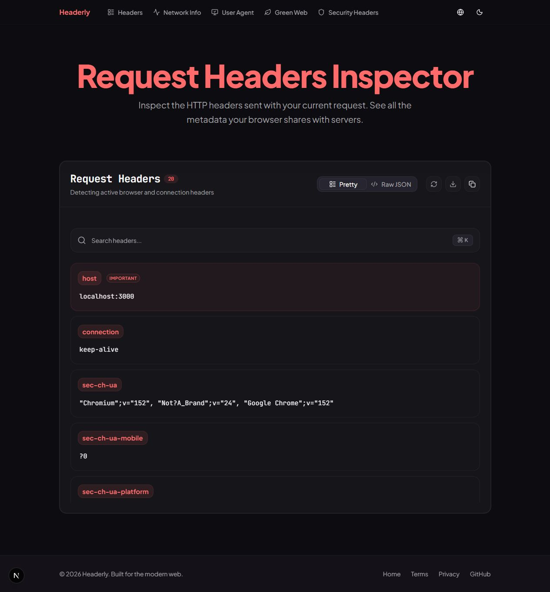

# Headerly

Headerly is a developer tool for inspecting the HTTP request headers sent by your browser and understanding the technical details visible to a web server. It also provides network, User-Agent, web security-header, and green-web analysis tools.



## What it provides

- **Request header inspection** — Browse the headers sent with the current request, search by name or value, filter by category, and open explanations with RFC and MDN references where available.
- **Pretty and Raw JSON views** — Switch between the readable header list and a JSON representation intended for debugging, copying, or export.
- **Network information** — View IP and approximate location/network metadata derived from request headers supplied by the hosting edge. Local or private networks may not have geolocation data.
- **User-Agent analysis** — Parse the current User-Agent into browser, operating system, device, and rendering-engine details.
- **Security Headers analyzer** — Check a public URL’s HTTP security response headers and receive a 0–100 score with recommendations.
- **Green Web analyzer** — Estimate a page’s carbon impact using its response size and green-hosting signals.
- **Privacy controls** — Headerly does not use a third-party geolocation API. The application analyzes request data in memory; hosting providers may still retain standard infrastructure logs.
- **Localization and themes** — English, Turkish, German, Spanish, French, Hindi, and Chinese translations, plus dark and light themes.
- **Responsive interface** — Desktop and mobile layouts with keyboard-accessible controls and overflow-safe technical values.

## Web routes

The application uses Next.js App Router with locale-aware rendering. Locales are selected from the browser/request context rather than being added as a visible URL prefix.

| Route | Purpose |
| --- | --- |
| `/` | Educational landing page |
| `/headers` | Current request-header inspector |
| `/network` | Network and approximate location details |
| `/user-agent` | User-Agent parser |
| `/green-web` | Web carbon-footprint analyzer |
| `/security-headers` | HTTP security-header analyzer |
| `/privacy` | Privacy policy |
| `/terms` | Terms of service |

## Public API

The API is available under `https://headerly.net/api`. Interactive API documentation is available at [`/api/docs`](https://headerly.net/api/docs), and the OpenAPI document is available at [`/api/openapi.json`](https://headerly.net/api/openapi.json).

| Method | Endpoint | Description |
| --- | --- | --- |
| `GET` | `/api` | API information and endpoint index |
| `GET` | `/api/headers` | Headers from the current request |
| `GET` | `/api/network` | IP and Cloudflare-derived network metadata |
| `GET` | `/api/user-agent` | Parsed browser, OS, device, and engine data |
| `GET` | `/api/header-info` | Header documentation and MDN links |
| `POST` | `/api/security-check` | Analyze a URL’s security response headers; body: `{ "url": "https://example.com" }` |
| `POST` | `/api/carbon-check` | Estimate a URL’s page carbon impact; body: `{ "url": "https://example.com" }` |

API requests are rate-limited to 30 requests per minute per IP. CORS and `OPTIONS` handling are implemented for the API routes.

## Tech stack

- [Next.js 16.3.3](https://nextjs.org/) with App Router and Turbopack
- [React 19](https://react.dev/) and [TypeScript](https://www.typescriptlang.org/)
- [Tailwind CSS 4](https://tailwindcss.com/) with PostCSS
- [Radix UI](https://www.radix-ui.com/) primitives and [shadcn/ui](https://ui.shadcn.com/) components
- [Lucide React](https://lucide.dev/) icons
- [next-intl](https://next-intl.dev/) for localization
- [next-themes](https://github.com/pacocoursey/next-themes) for theme switching
- [ua-parser-js](https://github.com/faisalman/ua-parser-js) for User-Agent parsing
- [Prism React Renderer](https://github.com/FormidableLabs/prism-react-renderer) for the raw JSON view
- [OpenNext](https://opennext.js.org/) and [Cloudflare Workers](https://developers.cloudflare.com/workers/) for deployment

## Local development

### Requirements

- Node.js 20.9 or newer (required by Next.js 16)
- npm

### Run the project

```bash
git clone https://github.com/Alchustan/headerly.git
cd headerly
npm install
npm run dev
```

Open [http://localhost:3000](http://localhost:3000). If that port is occupied, Next.js selects another available port and prints it in the terminal.

### Checks and production build

```bash
npm run lint
npm run typecheck
npm run build
npm start
```

`npm run format` formats TypeScript and TSX files with Prettier.

## Cloudflare deployment

The project is configured for OpenNext on Cloudflare Workers. After authenticating Wrangler and configuring the required Cloudflare account access:

```bash
npm run build:worker
npm run deploy:worker
```

Deployment settings live in [`wrangler.jsonc`](wrangler.jsonc); the production route is configured for `headerly.net`.

## Project structure

```text
headerly/
├── app/
│   ├── [locale]/          # Localized pages and layout
│   ├── api/               # API routes and OpenAPI/docs endpoints
│   ├── actions/           # Server actions for analyzers
│   ├── globals.css        # Global styles and design tokens
│   ├── manifest.ts        # Web app manifest
│   ├── robots.ts          # Robots metadata
│   └── sitemap.ts         # Sitemap generation
├── components/            # Feature components and reusable UI primitives
├── hooks/                 # Shared React hooks
├── i18n/                  # next-intl routing and request configuration
├── lib/                   # Header data, API helpers, metadata, and analyzers
├── messages/              # Translation dictionaries for seven locales
├── public/                # Static assets, including the README screenshot
├── middleware.ts          # Locale/request middleware
├── next.config.mjs        # Next.js configuration
└── wrangler.jsonc         # Cloudflare Workers configuration
```

## Contributing

1. Fork the repository and create a focused branch.
2. Install dependencies and run `npm run lint`, `npm run typecheck`, and `npm run build`.
3. Make the change, keeping user-visible copy localized in `messages/`.
4. Open a pull request with a concise description and verification notes.

## License

Headerly is available under the [MIT License](LICENSE).

Built by [Barış Yıldızoğlu](https://github.com/Alchustan).
